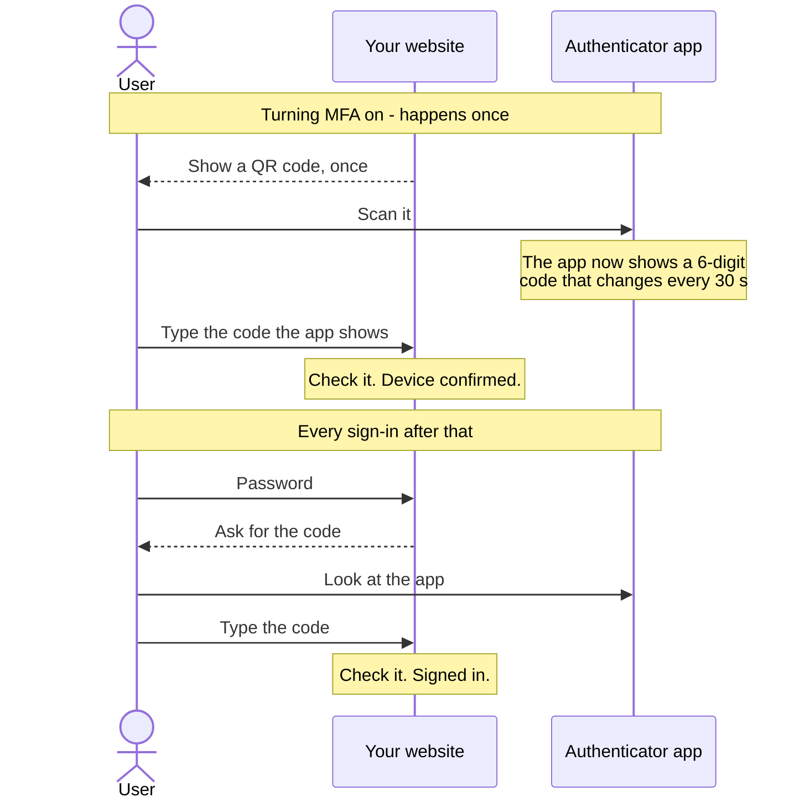

# Adding NLR Identity MFA to Your Website

This guide is for adding two-factor sign-in to **your own** website using the code in this
repository. It has three parts: how the flow works, a prompt you can give an AI coding agent, and a
checklist to confirm the result is correct.

---

## 1. How it works — read this first



**The code is never sent, and your website never shows it.**

- It is not texted or emailed. There is no "send code" step.
- The authenticator app **calculates** it from the secret in the QR code and the current time.
- The user reads it off their phone and types it in. Your website only **receives** the code and
  checks it.

If your website displays a six-digit code, MFA is broken: anyone who knows the password can read the
second factor off the screen. Two common causes:

| What you see | Cause | Fix |
|---|---|---|
| `042731`, never changing | The landing-page illustration (`HeroSection.tsx`) was copied. It is a fixed fake number. | Delete it. |
| A code that changes every 30 seconds | Code calls `generateTotp()` to put a code on screen. | Delete it. The site must only call `verifyTotp()` on a code the user typed. |

---

## 2. Prompt for an AI coding agent

Copy everything in the box and give it to your agent (Claude, Copilot, Cursor, and so on).

```text
Add TOTP two-factor authentication (RFC 6238) to my existing website, using the open-source
reference implementation at https://github.com/developerforpeople/mfa-for-free

BEFORE WRITING ANY CODE, ask me these and wait for the answers:
1. My frontend framework, and whether I have a backend server (Node, Python, PHP, Java...) or
   only a hosted backend such as Firebase.
2. Where user accounts are stored, and how sign-in works today.

THE FLOW - implement exactly this.

Turning MFA on (the user is already signed in):
1. Generate a random 20-byte secret with a cryptographic RNG, Base32-encoded. Save it against the
   user as a device with status "pending".
2. Build the provisioning URI:
     otpauth://totp/<Issuer>:<account>?secret=<SECRET>&issuer=<Issuer>&algorithm=SHA1&digits=6&period=30
   Percent-encode the issuer and account. Encode spaces as %20, never as +.
3. Show that URI as a QR code, with the Base32 key underneath for manual entry. This is the ONLY
   time the secret is ever shown.
4. The user scans it with an authenticator app. The APP then shows a 6-digit code.
5. The user types that code into my site. Verify it using the rules below.
   - Valid: set the device to "active", turn MFA on for the account, create 10 recovery codes,
     show them ONCE, and store only their hashes.
   - Invalid: leave the device "pending" and let the user try again.

Signing in when MFA is on:
1. Check the password exactly as my site does today.
2. If the account has an active device, do NOT complete the sign-in yet. Ask for the code.
3. Verify the code. Complete the sign-in only if it is valid.
4. Offer "use a recovery code" instead. A recovery code works once, then never again.

RULES - do not break any of these.
- NEVER display, log, email, text, or return a one-time code from my website or server. Codes
  appear ONLY in the user's authenticator app. My site only RECEIVES a code the user typed and
  checks it with verifyTotp(). Outside totpService.ts itself and its tests, never call
  generateTotp() or generateForCounter() - if you are about to, stop, because it means you are
  showing a code.
- There is no SMS or email step. Nothing is "sent".
- Never show the secret again after step 3 of enrollment.
- Verify codes ON THE SERVER. A browser can fake any result. The reference project verifies in
  the browser only because it has no server - do not copy that shortcut. If I have no server,
  stop and tell me, and point me to
  examples/integration-examples/firebase-cloud-functions.md in the reference repository.
- Accept the current 30-second time step and one step either side. Never wider.
- Replay protection: store the time step of the last successful code for each device, and reject
  any code whose step is the same or earlier.
- After 5 failed code attempts, make the user enter the password again.
- Store recovery codes only as PBKDF2 hashes. Store the TOTP secret encrypted if my stack allows
  it, and never anywhere the browser can read it.
- Do not copy the landing page (HeroSection.tsx). Its "042731" is an illustration, not a code.

REUSE THESE FILES - do not rewrite the cryptography.
From demo-website/src/services/ in the reference repository:
- totpService.ts - generation and verification. Pure TypeScript using Web Crypto; runs in any
  modern browser and in Node 20+. Copy it unchanged. Use verifyTotp() and timingSafeEqual().
- recoveryService.ts - recovery codes and PBKDF2 hashing. Copy it unchanged.
- totpService.test.ts and recoveryService.test.ts - copy these and make them pass. They hold the
  published RFC 6238, RFC 4226 and RFC 4648 test vectors. If one fails, the code is wrong - never
  edit an expected value to make it pass.
- From mfaService.ts, copy only generateSecret(), base32Encode() and buildOtpauthUri(). They are
  pure. The rest of that file is tied to Firestore - port its pending -> active logic to my
  database instead of copying it.
- If my backend is not TypeScript, port totpService faithfully and port the RFC vector tests
  with it.
Fetch them directly:
https://raw.githubusercontent.com/developerforpeople/mfa-for-free/main/demo-website/src/services/totpService.ts
https://raw.githubusercontent.com/developerforpeople/mfa-for-free/main/demo-website/src/services/recoveryService.ts
https://raw.githubusercontent.com/developerforpeople/mfa-for-free/main/demo-website/src/services/totpService.test.ts
https://raw.githubusercontent.com/developerforpeople/mfa-for-free/main/demo-website/src/services/recoveryService.test.ts
https://raw.githubusercontent.com/developerforpeople/mfa-for-free/main/demo-website/src/services/mfaService.ts
https://raw.githubusercontent.com/developerforpeople/mfa-for-free/main/demo-website/src/security.test.ts

Also add a test to my project that fails if any file other than the TOTP module and its tests
references generateTotp or generateForCounter. The reference project does this in
demo-website/src/security.test.ts.

WHEN FINISHED, prove it works and report the result of each check:
1. Scanning the QR with Google Authenticator makes a code appear IN THE APP. No code appears
   anywhere on my website.
2. Typing the app's code into my site makes the device active.
3. After signing out and back in, my site asks for a code after the password.
4. A wrong code is rejected. The same correct code used a second time is rejected.
5. A recovery code works once and is rejected the second time.
6. generateTotp and generateForCounter appear only in the TOTP module and tests.
7. The copied RFC tests pass.
```

---

## 3. Check the result yourself

Do this with a real phone, whoever wrote the code.

1. Turn MFA on. **A QR code appears. No six-digit code appears anywhere on your site.**
2. Scan it with Google Authenticator or Microsoft Authenticator. A code appears **in the app**.
3. Type that code into your site. The device is confirmed and you are given recovery codes.
4. Sign out. Sign in with your password. **Your site asks for a code.**
5. Type the code from the app. You are signed in.
6. Sign out and in again, and type **the same code** before it changes. It must be rejected.
7. Type a wrong code. It must be rejected.
8. Use a recovery code. It works. Use the same one again. It must be rejected.

If step 1 shows a code on your site, or step 6 accepts a reused code, the integration is not safe.

**A correct code keeps being rejected?** Almost always, your phone's clock is wrong. Turn on
**Set time automatically**. The [troubleshooting section](docs/firebase-setup.md) has a tool that
measures the difference.

---

## 4. Files to reuse

| File | What it does | Copy it? |
|---|---|---|
| [`totpService.ts`](demo-website/src/services/totpService.ts) | Generates and verifies codes | Yes, unchanged |
| [`recoveryService.ts`](demo-website/src/services/recoveryService.ts) | Recovery codes, PBKDF2 hashing | Yes, unchanged |
| [`totpService.test.ts`](demo-website/src/services/totpService.test.ts) | RFC test vectors | Yes, and keep them passing |
| [`recoveryService.test.ts`](demo-website/src/services/recoveryService.test.ts) | Recovery-code tests | Yes |
| [`security.test.ts`](demo-website/src/security.test.ts) | Fails if code is generated for display | Adapt the paths to your project |
| [`mfaService.ts`](demo-website/src/services/mfaService.ts) | Enrollment and verification flow | Copy the three pure functions; port the rest |
| [Cloud Functions example](examples/integration-examples/firebase-cloud-functions.md) | Server-side verification on Firebase | Read it if you have no server of your own |
