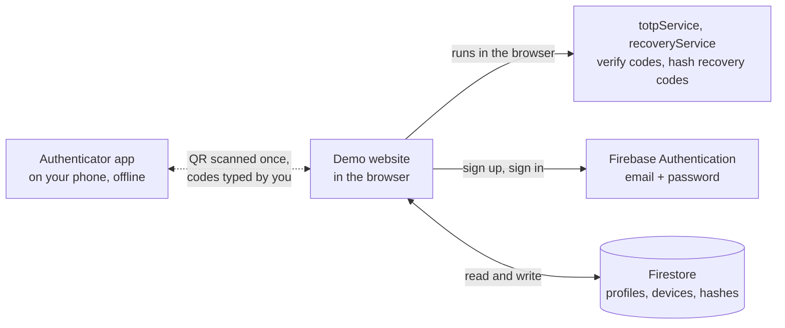
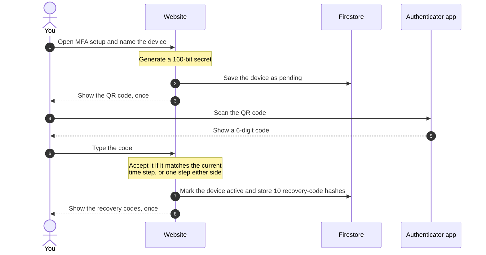
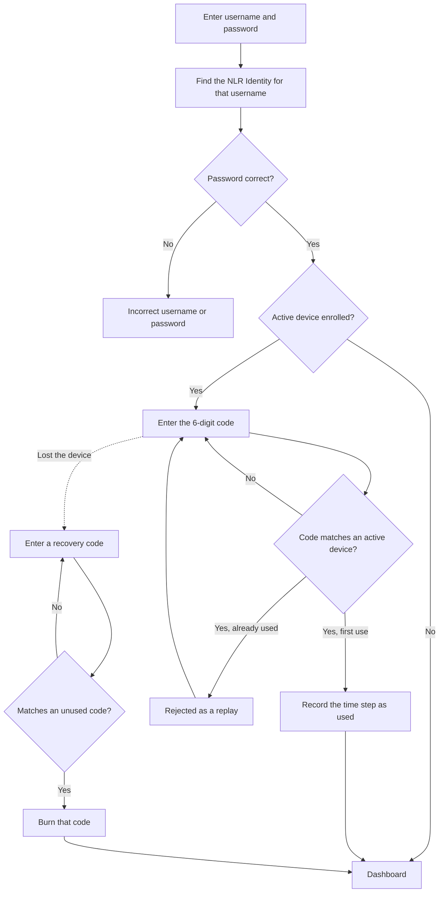

<h1 align="center">NLR Identity</h1>

<p align="center"><strong>Learn MFA. Build Secure Authentication.</strong></p>

<p align="center">
  An open-source, educational multi-factor authentication platform. Read the code, follow the
  flow end to end, and see exactly how a second factor works.
</p>

<p align="center">
  <a href="https://github.com/developerforpeople/mfa-for-free/actions/workflows/ci.yml"></a>
  <a href="LICENSE"></a>
  <a href="demo-website/src/services/totpService.test.ts"></a>
</p>

---

Most developers learn one authentication pattern: username, password, database lookup. NLR Identity
shows the rest — where a six-digit code comes from, what a QR code actually carries, and how two
devices that never talk to each other agree on the same number every 30 seconds.

It is a working website you can run, plus the documentation that explains every step.

> **Educational software.** It takes one deliberate shortcut, described under [Security](#security).
> Do not use it as the login system for a real product.

## Features

- **NLR Identity accounts** — sign up with a name on a closed domain (`john` → `john@nlr.com`),
  sign in with a username
- **QR device enrollment** — a standard `otpauth://` QR code that works in Google Authenticator,
  Microsoft Authenticator, 1Password, or any TOTP app
- **Device confirmation** — a device stays `pending` until its first code verifies
- **Two-factor sign-in** — a code is required after the password once a device is active
- **Multiple devices** — each with its own secret, each revocable on its own
- **Recovery codes** — ten single-use codes, stored only as hashes
- **Clock-skew diagnostics** — the site and a CLI tool explain *why* a correct-looking code failed

## How It Works

### System overview



The dotted line is not a network connection. The QR code travels through your phone's camera,
and each code travels through you. After enrollment, the website and the app never exchange
anything — each computes the same code from the shared secret and the current time.

### Enrolling a device



Typing that first code is the handshake. A code the website can reproduce proves the secret
arrived intact and that both clocks agree — until then the device cannot be used to sign in.

### Signing in



The same message is shown for an unknown username and a wrong password, so the form does not
reveal which usernames exist.

## Metrics

All figures are measured from this repository, not estimated.

**Security parameters**

| Parameter | Value |
|---|---|
| Shared secret | 160 bits (20 random bytes) |
| Code | 6 digits, 30-second step, HMAC-SHA1 ([RFC 6238](https://datatracker.ietf.org/doc/html/rfc6238)) |
| Drift window | ±1 step, about 90 seconds |
| Chance of a blind guess | 1 in 333,333 with one device (3 of 1,000,000 codes accepted at any moment) |
| Replay protection | a time step that already succeeded is refused |
| Recovery codes | 10 codes × 10 characters, 49.1 bits each |
| Recovery-code storage | PBKDF2-SHA256, 210,000 iterations, a separate salt per code |

**Correctness**

| Check | Result |
|---|---|
| Automated tests | 35 passing, run by CI on every push |
| RFC 6238 TOTP vectors (SHA-1, SHA-256, SHA-512) | 18 / 18 |
| RFC 4226 HOTP vectors | 10 / 10 |
| RFC 4648 Base32 vectors | 6 |

Passing the published vectors is what makes the site agree with every standard authenticator app.

**Size and speed**

| Metric | Value |
|---|---|
| Production bundle | 322 kB gzipped — the Firebase SDK is 163 kB of it |
| Runtime dependencies | 8 |
| Core authentication logic | 529 lines across 3 files, comments excluded |
| Generate a code | 0.06 ms |
| Verify a code | 0.10 ms |
| Check one recovery-code guess | 28 ms — slow on purpose, to make guessing expensive |

Timings measured with Node 24 on one core of a Windows x64 machine.

## Quick Start

Requires **Node.js 20.19+ or 22.12+**.

```bash
git clone https://github.com/developerforpeople/mfa-for-free.git
cd mfa-for-free/demo-website
npm install
cp .env.example .env.local     # add your Firebase project values
npm run dev                    # http://localhost:5173
```

The landing page runs with no configuration. To register and sign in you need a Firebase project
with **Email/Password** sign-in enabled and `firestore.rules` deployed — the
[setup guide](docs/firebase-setup.md) covers a real project and the local emulator.

| Command | What it does |
|---|---|
| `npm run dev` | Development server with hot reload |
| `npm test` | RFC conformance and security tests |
| `npm run lint` | ESLint |
| `npm run typecheck` | TypeScript, no emit |
| `npm run build` | Production build |
| `npm run totp-doctor -- <key> <code>` | Measures how far your phone's clock is off when a code is rejected |

| Route | Page | Access |
|---|---|---|
| `/` | Landing page | Public |
| `/register`, `/login` | Create an identity, sign in | Signed out |
| `/verify` | Second factor at sign-in | Signed in |
| `/dashboard` | Account, devices, recovery codes | Signed in and verified |
| `/mfa-setup` | Enrol and confirm a device | Signed in and verified |

## Project Structure

```
mfa-for-free/
├── demo-website/
│   └── src/
│       ├── services/        totpService, recoveryService, mfaService, userService
│       ├── firebase/        Firebase config, Auth, and Firestore access
│       ├── pages/           Home, Register, Login, VerifyMfa, Dashboard, MFASetup
│       ├── components/      UI building blocks and route guards
│       └── context/         Sign-in and MFA session state
├── docs/                    How MFA and TOTP work, the flows, the schema, setup
├── examples/                Adding MFA to your own project, including server-side verification
├── firestore.rules          Database access control
└── CUSTOMISING.md           What is safe to change, and what is not
```

## Security

- **Codes are never stored or sent.** Your authenticator computes them offline, and the website
  compares and discards them.
- **Recovery codes are credentials.** Only PBKDF2 hashes are stored, and each code works once.
- **`firestore.rules` is the real access control.** The React route guards only hide pages.

**The one shortcut:** the demo verifies codes **in the browser** and stores device secrets
**unencrypted** in Firestore, so the whole flow is readable without a paid Cloud Functions plan.
A browser can claim any result it likes, so this is not safe for production.
[The Cloud Functions example](examples/integration-examples/firebase-cloud-functions.md) shows how to
move verification to a server.

To report a vulnerability, see [SECURITY.md](SECURITY.md).

## Documentation

| Guide | Covers |
|---|---|
| [What MFA is](docs/mfa-explanation.md) | Why passwords are not enough, and the types of second factor |
| [How TOTP works](docs/totp-working.md) | Where the six digits come from, with a worked example |
| [Authentication flow](docs/authentication-flow.md) | Enrollment, sign-in and recovery, step by step |
| [Architecture](docs/architecture.md) | Components and trust boundaries |
| [Database design](docs/database-design.md) | Firestore collections and rules |
| [Firebase setup](docs/firebase-setup.md) | Running against a real project or the emulator |

## Contributing

Changing the design or adding your own dashboard is encouraged — read
[CUSTOMISING.md](CUSTOMISING.md) first, since it marks which files can change freely and which
carry the security. Then see [CONTRIBUTING.md](CONTRIBUTING.md).

## License

[MIT](LICENSE)
