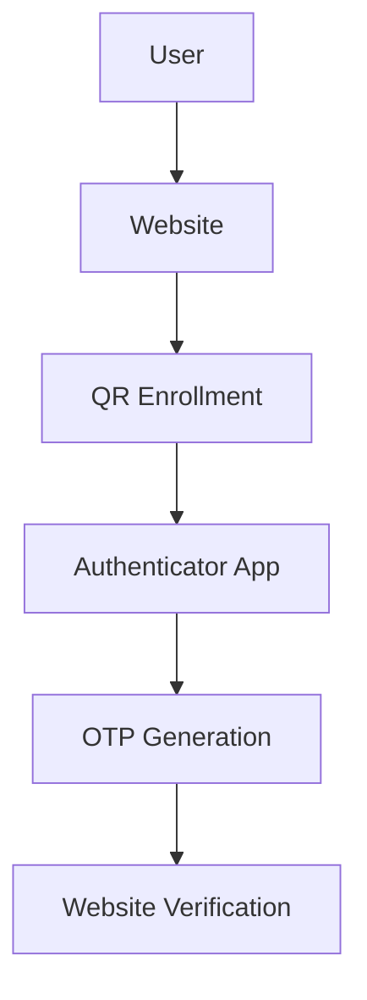

<h1 align="center">NLR Identity</h1>

<p align="center"><strong>Learn MFA. Build Secure Applications.</strong></p>

<p align="center">
  An open-source, educational multi-factor authentication platform for students and developers
  who want to understand how enterprise authentication actually works.
</p>

<p align="center">
  <a href="LICENSE"></a>
  
  
</p>

---

> **NLR Identity is not a clone of Google Authenticator.**
> It is a teaching implementation. Every layer is documented so you can read the code, follow the
> flow end to end, and understand *why* each step exists — not just copy it.

---

## The Problem

Most students learn exactly one authentication pattern: a username, a password, and a database
lookup. That is where the syllabus stops. When they join a real engineering team they meet a system
that looks nothing like it, and the gaps show up fast:

- **MFA** — why a second factor exists at all, and what "something you know / have / are" means in code.
- **OTP generation** — where a 6-digit code comes from, and why it is not random.
- **QR enrollment** — what is actually encoded in that square, and why it is shown exactly once.
- **Device verification** — how a server decides that *this* phone belongs to *that* account.
- **TOTP** — how two machines that never talk to each other agree on the same number every 30 seconds.

Tutorials tend to hand over a library call. That teaches integration, not authentication.

## The Solution

NLR Identity rebuilds a small but honest MFA system in the open, in layers you can read in an
afternoon:

1. A **demo website** (React + TypeScript) that plays the role of the relying party — the app that
   wants to be sure who you are.
2. **Any standard authenticator app** — Google Authenticator, Microsoft Authenticator,
   1Password — plays the role of the trusted device, generating codes offline from the secret it
   scanned. The enrollment QR is a standard `otpauth://` URI, so no custom app is needed.
3. A **documentation set** that explains the cryptography and the protocol in plain language,
   with the RFCs linked for when you want the formal version.

You get to see both sides of the handshake, which is the part a single tutorial never shows you.

## Features

| | Feature | What it teaches | State |
|---|---|---|---|
| ✓ | **NLR Identity Account** | Identity creation, credential storage, account state | Working |
| ✓ | **QR Device Enrollment** | Out-of-band secret transfer and one-time provisioning | Working |
| ✓ | **Offline OTP Generation** | TOTP, HMAC, and time-based synchronisation without a network | In your authenticator app |
| ✓ | **Encrypted Secret Storage** | Protecting the seed at rest with the OS keystore | In your authenticator app |
| ✓ | **Multiple Device Support** | One identity, many authenticators, per-device revocation | Working |
| ✓ | **Recovery Codes** | Single-use backup credentials and safe hashing | Working |
| ✓ | **Open Source Learning Platform** | Readable code, documented decisions, no black boxes | Working |

## Architecture



The shared secret crosses the boundary exactly once, during enrollment. After that, the phone and
the server never exchange it again — they independently derive the same code from it.

Read the long version in [docs/architecture.md](docs/architecture.md) and
[docs/authentication-flow.md](docs/authentication-flow.md).

## Security Principles

These four rules constrain every design decision in the project:

1. **OTPs are never stored.** Not in the database, not in logs, not in a cache. A code that exists
   in storage is a code an attacker can read.
2. **OTPs are generated locally.** The authenticator computes the code on the device. Nothing is
   transmitted to produce it, so there is no OTP in flight to intercept.
3. **Device secrets are encrypted at rest.** The seed lives on the device under AES-GCM, with the
   key held by the platform keystore — never in plaintext, never in shared preferences.
4. **Authentication works offline.** Time is the only input both sides share. Airplane mode,
   dead Wi-Fi, and a captive portal are all irrelevant to code generation.

A fifth, unofficial one: nothing in this repository is hidden behind a wrapper you cannot read.

## Repository Layout

```
nlr-identity/
├── docs/                        Written explanations of the system
│   ├── architecture.md          Components, boundaries, trust model
│   ├── authentication-flow.md   Enrollment and login, step by step
│   ├── mfa-explanation.md       Why a second factor exists
│   ├── totp-working.md          How the 6 digits are computed
│   └── database-design.md       Firestore collections and rules
├── demo-website/                React + TypeScript + Vite + Tailwind demo
├── firestore.rules              Firestore security rules - the real access control
├── firebase.json                Emulator, rules, and hosting configuration
└── examples/
    └── integration-examples/    Drop-in snippets for your own project
```

## Running the Demo Locally

Requires **Node.js 20.19+ or 22.12+** and npm.

```bash
# 1. Clone
git clone https://github.com/developerforpeople/mfa-for-free.git
cd mfa-for-free/demo-website

# 2. Install
npm install

# 3. Configure environment
cp .env.example .env.local     # then add your Firebase project values

# 4. Run
npm run dev
```

The site is served at <http://localhost:5173>.

The landing page works with no configuration at all. Registration, sign-in, and MFA enrollment
need a Firebase project - see [the setup guide](docs/firebase-setup.md), which covers both a real
project and the local emulator.

| Route | Page | Access |
|---|---|---|
| `/` | Landing page | Public |
| `/register` | Create an NLR Identity | Public |
| `/login` | Sign in with a username | Public |
| `/verify` | Second factor at sign-in | Signed in |
| `/dashboard` | Profile, MFA status, devices, recovery codes | Signed in + verified |
| `/mfa-setup` | Enrol and confirm a device | Signed in + verified |

| Command | Description |
|---|---|
| `npm run dev` | Start the Vite dev server with hot reload |
| `npm run build` | Type-check and produce a production build |
| `npm run preview` | Serve the production build locally |
| `npm run lint` | Run ESLint across the project |
| `npm run typecheck` | Run the TypeScript compiler with no emit |

## Project Status

NLR Identity is built in phases so each one stays readable.

| Phase | Scope | State |
|---|---|---|
| **1** | Repository foundation, documentation, landing page, design system | ✅ Complete |
| **2** | Firebase Auth, identity creation, login, MFA enrollment QR | ✅ Complete |
| **3** | Companion authenticator app | Not published here — any TOTP app works |
| **4** | Code verification, recovery codes, multi-device management | ✅ Complete |

### Phase 4 completed

- **Code verification** - RFC 6238 verification on the website, with a ±1 step drift window,
  constant-time comparison, and replay rejection by counter
- **Enrollment confirmation** - a device stays `pending` until its first code verifies
- **Recovery codes** - ten single-use credentials, PBKDF2-hashed, issued when MFA is switched on
- **Login second factor** - `/verify` asks for a code, or a recovery code if the device is gone
- **Device management** - revoke any device; the last one turning off MFA is spelled out first
- **Server-side example** - [Cloud Functions walkthrough](examples/integration-examples/firebase-cloud-functions.md)
  showing how to move verification off the client

### Phase 2 completed

- **Firebase Authentication** - email/password, with the NLR Identity as the address
- **NLR Identity creation** - `john` becomes `john@nlr.com`; public mail domains are rejected
- **Firestore profile storage** - `users/{uid}` written atomically with a username claim
- **Login system** - sign in by username, resolved to an identity before authenticating
- **MFA enrollment QR preparation** - a Base32 secret, an `otpauth://` URI, and a scannable QR

### The one shortcut, stated plainly

The demo website **verifies codes in the browser**. That is wrong for production - a client can
claim any result it likes - and the project says so in the code, in the UI, and here.

It is done that way because Cloud Functions require a billing plan, and nobody should have to
enter card details to learn how MFA works. The verification logic is deliberately free of React
and Firebase so that moving it server-side is a copy-paste;
[the Cloud Functions example](examples/integration-examples/firebase-cloud-functions.md) is that
move, written out in full.

## Contributing

New contributors are welcome, including first-time ones — this is a learning project, and reviews
are written to teach. Start with [CONTRIBUTING.md](CONTRIBUTING.md).

## Security

This is educational software. Please do not deploy it as the authentication layer of a production
system. To report a vulnerability in the project itself, follow [SECURITY.md](SECURITY.md).

## License

[MIT](LICENSE) © NLR Identity contributors
