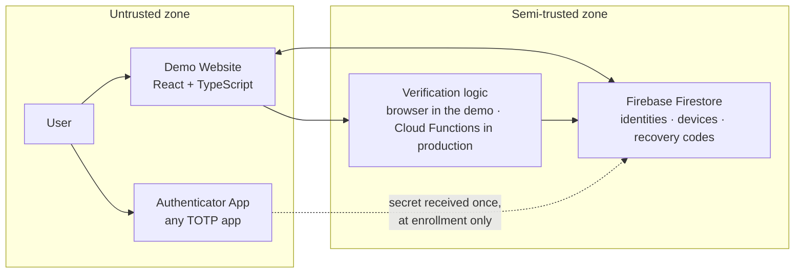
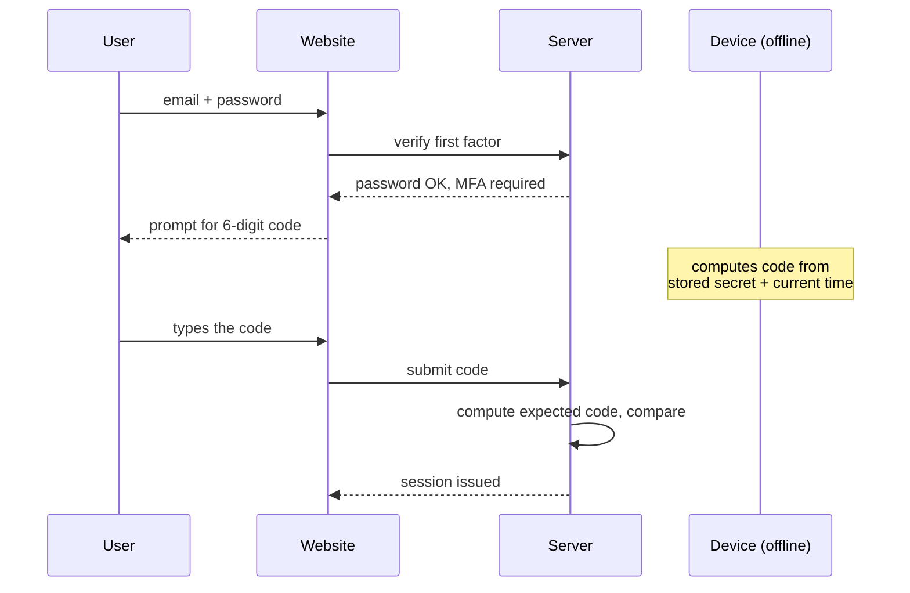

# Architecture

> **Audience:** students and junior developers who have built a login form but never a second factor.
> **Prerequisites:** you know what an HTTP request is and roughly what a database does.

This document describes what the parts of NLR Identity are, who is allowed to know what, and where
the trust boundaries sit. If you only read one page before touching the code, read this one.

---

## 1. The Big Picture

There are three participants, and the whole design comes from the fact that they do not trust each
other equally.

Notice what is missing from that diagram: there is **no arrow from the authenticator app to the
server at login time**. The app never phones home to produce a code. That absence is the single
most important property of the system, and everything below exists to preserve it.

---

## 2. The Components

### 2.1 Demo Website (`demo-website/`)

**Role:** the *relying party* — the application that needs to be sure who you are.

| Layer | Directory | Responsibility |
|---|---|---|
| Pages | `src/pages/` | Route-level compositions. One file per screen. |
| Components | `src/components/` | Reusable, presentational UI. No data fetching. |
| Services | `src/services/` | All Firebase and network access. The only layer that talks outward. |
| Utils | `src/utils/` | Pure functions. No React, no I/O, trivially testable. |
| Styles | `src/styles/` | Design tokens and global CSS. |

The rule that keeps this readable: **data flows down through props, and outward calls go through
`services/`.** A component that imports Firebase directly is a bug, because it makes the component
impossible to test and impossible to reason about in isolation.

Stack: React 19, TypeScript 5, Vite 7, Tailwind CSS 4.

### 2.2 Authenticator App (any TOTP app)

**Role:** the *authenticator* — the trusted device that holds the secret and computes codes.

This repository does not ship one, because it does not need to. The enrollment QR is a standard
`otpauth://` URI, so Google Authenticator, Microsoft Authenticator, 1Password and every other TOTP
app can play this role. What any of them does:

- Scan the enrollment QR code and parse the `otpauth://` URI
- Encrypt the extracted secret and write it to device storage
- Compute the current TOTP code every 30 seconds, entirely offline
- Manage several enrolled identities on one device
- Never transmit a secret or a generated code anywhere

Which app is irrelevant to the protocol — that interoperability is the point of a standard.

### 2.3 Firestore (`Firebase`)

**Role:** durable state for identities, enrolled devices, and recovery codes.

Firestore holds the *shared secret* for each device, because the server needs it to verify a code.
It never holds a generated OTP. See [database-design.md](database-design.md) for the collections
and the security rules.

---

## 3. Trust Boundaries

A trust boundary is a line where data crosses from something you control to something you do not.
Every one of them needs a rule.

| # | Boundary | Threat | Mitigation |
|---|---|---|---|
| 1 | Browser → Server | Anyone can forge a request from a browser | Server-side verification only; never trust a client-supplied "verified" flag |
| 2 | Server → QR → Device | The secret is in transit and on screen | TLS, single-use provisioning payload, short expiry, displayed exactly once |
| 3 | Device storage | Lost or rooted phone | AES-GCM encryption, key in the OS keystore, biometric gate on reveal |
| 4 | Firestore documents | One user reading another's devices | Security rules scoped to `request.auth.uid` |
| 5 | Time | Clock drift between phone and server | Accept a ±1 step window, no more |

Boundary 2 is the one students usually get wrong. The QR code contains the secret in plaintext —
that is unavoidable, since the device has no other way to learn it. What makes it safe is that the
window is small and the display is one-time: the payload expires in minutes, and the server will
never render that secret again. If the user did not scan it in time, they re-enroll and the old
secret is discarded.

---

## 4. Who Knows the Secret

This table is worth memorising. It explains most of the design.

| Party | Knows the shared secret | Knows the current OTP |
|---|---|---|
| Authenticator app | ✅ yes, encrypted at rest | ✅ computes it locally |
| Server (Firestore) | ✅ yes, needed for verification | ✅ computes it independently |
| The network | ❌ only once, during enrollment, over TLS | ❌ the user types the code; it is compared and discarded |
| Any log or cache | ❌ never | ❌ never |

The secret is a *shared* secret: both sides hold the same value and each computes the same code
from it. That is what makes offline generation possible, and it is also why protecting the secret
matters far more than protecting any individual code — a code lives 30 seconds, a secret lives
until the device is revoked.

---

## 5. Request Flow at Login

The device is drawn deliberately disconnected. It participates in the login without ever sending
or receiving a byte.

---

## 6. Why This Structure

A few decisions that are not obvious from the folder names:

**Why separate `services/` from `components/`?**
Because the moment a component knows about Firebase, you cannot render it in a test or a Storybook
without a network. Keeping the boundary means the UI is testable and the data layer is swappable —
if Phase 2 moves from Firestore to something else, one directory changes.

**Why is the demo website separate from the authenticator app?**
Because they are genuinely different security domains. The website is the party asking "who are
you"; the app is the party answering. Merging them would hide the boundary that the project exists
to teach.

**Why Firestore rather than a custom backend?**
It removes a whole class of setup work — no server to deploy, no ORM to learn — so a student can
get to the authentication concepts on day one. The trade-off is that the security rules become
load-bearing, which is why they are documented rather than left implicit.

**Why not just use a TOTP library?**
In production you absolutely should, and [SECURITY.md](../SECURITY.md) says so. Here, the point is
to open the box.

---

## 7. Where to Go Next

- [authentication-flow.md](authentication-flow.md) — enrollment and login, step by step
- [mfa-explanation.md](mfa-explanation.md) — why a second factor exists at all
- [totp-working.md](totp-working.md) — how the six digits are actually computed
- [database-design.md](database-design.md) — Firestore collections and rules
