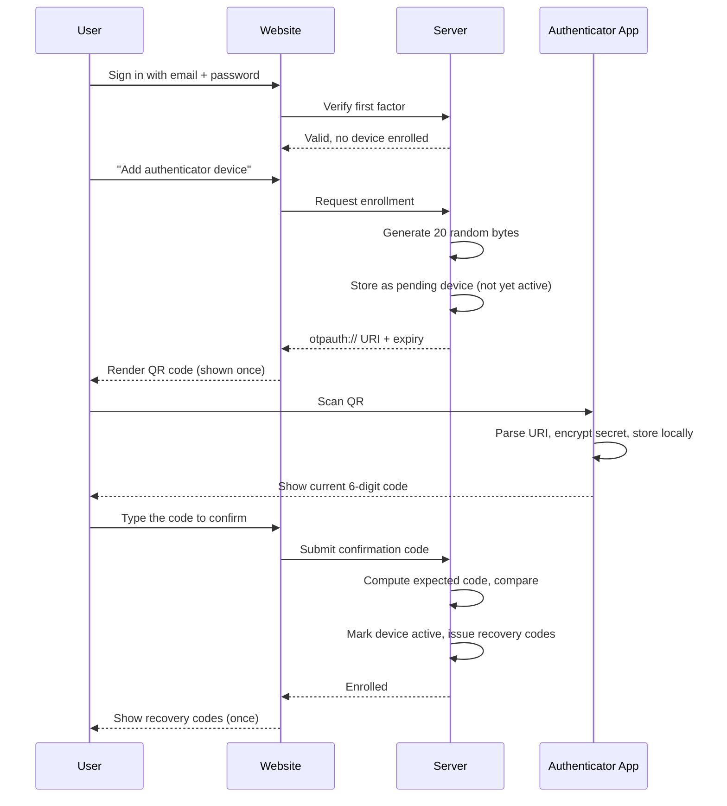
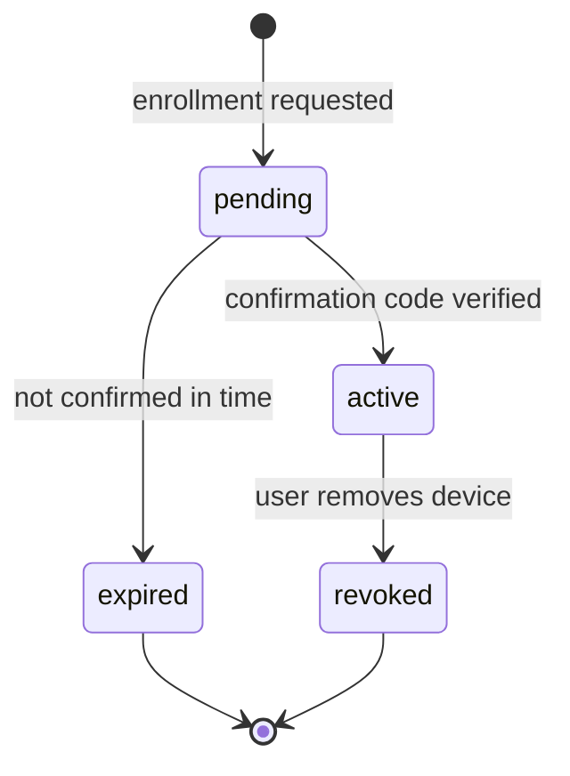
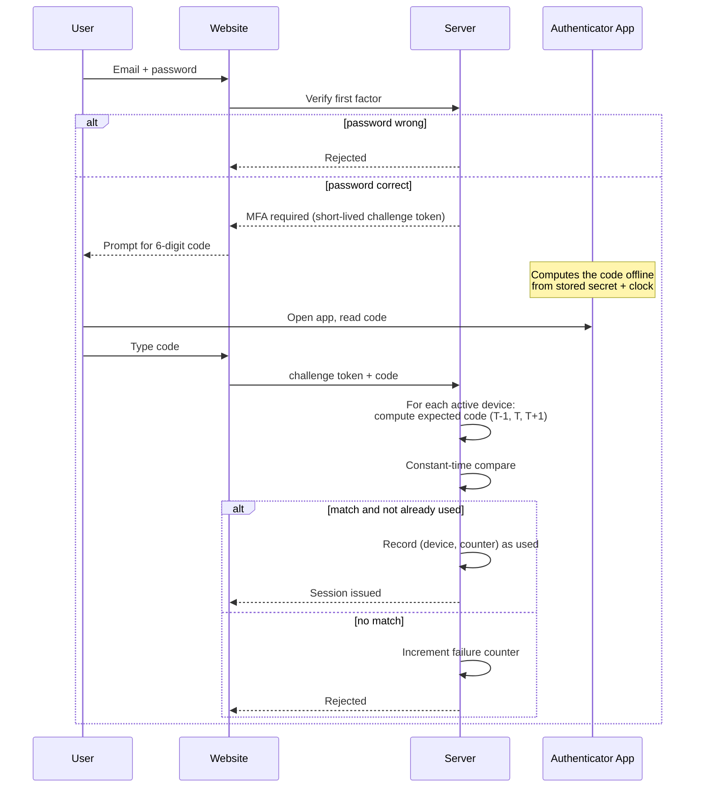
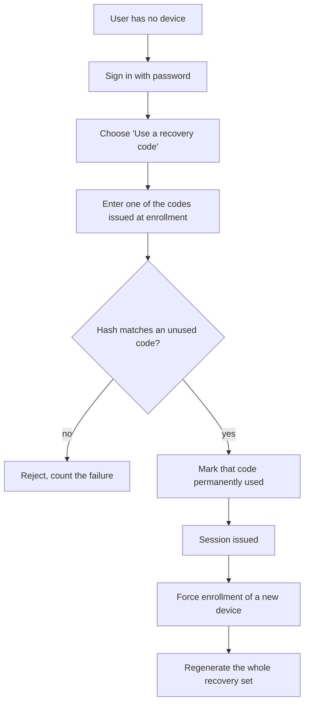

# Authentication Flow

> **Audience:** you understand [what MFA is](mfa-explanation.md) and roughly
> [how TOTP works](totp-working.md). This page joins them into the two flows a real system needs.

There are only two journeys worth understanding, plus one you hope nobody needs:

1. **Enrollment** — attaching a device to an identity. Happens once per device.
2. **Login** — proving you hold that device. Happens every time.
3. **Recovery** — getting back in when the device is gone.

---

## 1. Enrollment

### The Flow

### Why Each Step Exists

**The first factor comes first.** You must prove you own the account before you can attach a device
to it. Skip this and anyone who knows your email can enroll their own phone against your identity —
the second factor becomes the attacker's, not yours.

**The server generates the secret, not the client.** Browser randomness is harder to reason about,
and the server needs the value anyway to verify codes later. Generate it once, in the place that
must store it.

**The device starts as `pending`, not `active`.** Between rendering the QR and the user confirming,
anything can go wrong: a bad camera, a closed tab, a typo. Activating on display would leave
accounts locked behind devices that never actually received the secret. The confirmation step is
the proof that the transfer worked.

**The confirmation code is the handshake.** When the user types a code the server can reproduce,
both sides have proven they hold the same secret and their clocks agree. That is the entire
purpose of that awkward extra screen.

**The QR is shown exactly once.** A secret you can re-display is a secret an attacker with a brief
session can re-steal. Lost it? Re-enroll, and the pending secret is discarded.

**Recovery codes are issued at enrollment, not later.** The moment you add a factor you can lose,
you need a way back. Handing out recovery codes at the same time makes that non-optional.

### States a Device Moves Through

A `pending` device should expire in minutes, not days. It holds a live secret that nobody has
confirmed control of.

---

## 2. Login

### The Flow

### The Details That Matter

**The challenge token.** After the password check the user is half-authenticated, which is not a
state a session cookie should represent. A short-lived, single-purpose token (a couple of minutes,
valid only for code submission) carries that state instead. Without it you either issue a session
too early or ask the browser to remember the password.

**All active devices are checked.** An identity may have a phone and a tablet. The server tries
each active device's secret until one matches.

**The window is one step either side.** About 90 seconds of tolerance. See
[totp-working.md](totp-working.md#5-clock-drift-and-the-verification-window) for why widening it
is a bad trade.

**Comparison must be constant-time.** A `==` on strings can leak, through timing, how many leading
characters were right. Use your platform's constant-time comparison.

**Successful codes are burned.** Store the `(device, counter)` pair that just succeeded and reject
it if it comes back. Otherwise a code captured by a proxy or read over a shoulder is reusable for
the rest of its window.

**Failures are rate-limited.** Six digits is one million possibilities — trivially brute-forced if
you allow unlimited attempts. Lock the challenge after roughly five failures and require the first
factor again.

**Nothing about the code is logged.** Not the submitted value, not the expected one. Log the
outcome and the device id; that is enough to debug and useless to steal.

---

## 3. Recovery

Devices get lost, wiped, dropped in rivers, and replaced. Without a recovery path, MFA is a
mechanism for permanently locking users out of their own accounts.

Rules that make recovery codes safe rather than a backdoor:

- **They are credentials, so store them hashed** — the same way you would store a password.
  Plaintext recovery codes in the database are the vulnerability you were trying to prevent.
- **Single use.** Once redeemed, a code is dead forever, not merely rate-limited.
- **Issued as a set** — commonly ten — so losing one does not end the story.
- **Shown once, at generation.** Same reasoning as the QR code.
- **Regenerated after use**, once the account is under control again, so a stale printout does not
  stay live indefinitely.
- **Rate-limited like any other credential.**

---

## 4. Multiple Devices

One identity, many authenticators. This is a usability feature with a security consequence, so it
needs explicit rules:

| Rule | Why |
|---|---|
| Each device gets its **own secret** | Revoking a lost phone must not break the tablet |
| Any active device can complete a login | That is the point of adding a second one |
| Adding a device requires **an existing factor** | Otherwise a password alone can add an attacker's device |
| Revocation is immediate | A lost phone is an emergency; there is no grace period |
| Removing the **last** device disables MFA | The user must be warned in plain language |

That third rule is the one most often missed. If a password alone can enroll a new device, then a
stolen password alone defeats MFA entirely — the attacker just adds their own phone.

---

## 5. What Is Never Stored

Worth repeating, because it is the invariant the whole design protects:

| Data | Stored? | Where |
|---|---|---|
| Shared secret | ✅ | Firestore (server) and encrypted on the device |
| Generated OTP | ❌ | Never — computed, compared, discarded |
| Used `(device, counter)` marker | ✅ | Server, for replay protection |
| Recovery codes | ✅ | Hashed only |
| Password | ✅ | Hashed by Firebase Authentication |

---

## 6. Next

- [database-design.md](database-design.md) — the collections and rules behind these flows
- [architecture.md](architecture.md) — components and trust boundaries
