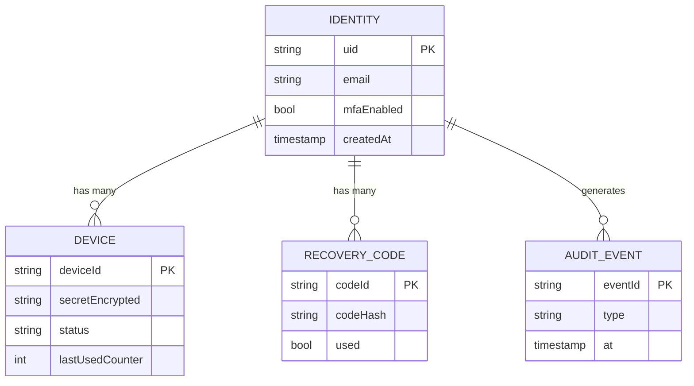

# Database Design

> **Audience:** you have used a database, but maybe not a document database, and definitely not one
> holding authentication secrets.

NLR Identity uses **Firebase Firestore**, a document database. Instead of tables and rows you have
collections and documents, and a document can contain a nested collection of its own.

This document defines the data model, the security rules, and — just as importantly — what the
database must never contain.

---

## 1. Overview



Devices, recovery codes, and audit events are **subcollections of an identity**. That is a
deliberate choice: it makes ownership part of the path, so a security rule can express "you may
only read your own devices" as a simple comparison instead of a query filter you might forget.

---

## 2. Collections

### 2.1 `identities/{uid}`

One document per account. The `uid` comes from Firebase Authentication, so this collection extends
the auth record rather than duplicating it.

```jsonc
{
  "uid": "aBcD1234...",              // matches the Firebase Auth UID
  "email": "student@example.com",
  "displayName": "Priya S.",
  "mfaEnabled": true,                // true once at least one device is active
  "createdAt": "2026-09-11T10:00:00Z",
  "updatedAt": "2026-09-11T10:04:12Z",
  "lastLoginAt": "2026-09-11T10:04:12Z",
  "failedMfaAttempts": 0,            // reset on success; used for lockout
  "lockedUntil": null                // timestamp while locked out
}
```

**No password field.** Firebase Authentication holds credentials, hashed, outside Firestore. Never
copy a password or a password hash here.

### 2.2 `identities/{uid}/devices/{deviceId}`

One document per enrolled authenticator.

```jsonc
{
  "deviceId": "dev_7fQ2...",
  "name": "Priya's Pixel 8",         // user-supplied label, for the revoke screen
  "platform": "android",             // android | ios
  "secretEncrypted": "base64...",    // AES-GCM ciphertext of the Base32 secret
  "secretIv": "base64...",           // 12-byte GCM nonce, unique per secret
  "keyVersion": 1,                   // which server key encrypted it — enables rotation
  "algorithm": "SHA1",
  "digits": 6,
  "period": 30,
  "status": "active",                // pending | active | revoked | expired
  "lastUsedCounter": 58412345,       // replay protection: reject anything <= this
  "createdAt": "2026-09-11T10:02:00Z",
  "confirmedAt": "2026-09-11T10:02:40Z",
  "expiresAt": null,                 // set while pending; enrollment window
  "lastUsedAt": "2026-09-11T10:04:12Z",
  "revokedAt": null
}
```

Field notes worth reading twice:

- **`secretEncrypted`, not `secret`.** The server needs the value to verify codes, so it cannot be
  hashed like a password — hashing is one-way and verification requires the original. Encryption is
  the correct tool: reversible, but only with a key that lives outside the database (in a KMS or
  secret manager, never in Firestore and never in the client bundle).
- **`secretIv`.** AES-GCM needs a unique nonce per encryption. Reusing one across secrets is a
  catastrophic break of GCM, not a minor slip.
- **`keyVersion`.** Without it, rotating the encryption key means re-encrypting everything at once
  or losing access. With it, you decrypt with the version recorded and re-encrypt lazily.
- **`lastUsedCounter`.** This is the replay defence from
  [authentication-flow.md](authentication-flow.md#2-login). Store the counter that last succeeded
  and refuse anything at or below it.
- **`status`.** `pending` devices hold a live but unconfirmed secret and must expire quickly.

### 2.3 `identities/{uid}/recoveryCodes/{codeId}`

One document per code. Typically ten are generated at enrollment.

```jsonc
{
  "codeId": "rc_01",
  "codeHash": "$argon2id$v=19$...",  // hash of the code, never the code itself
  "used": false,
  "createdAt": "2026-09-11T10:02:40Z",
  "usedAt": null,
  "usedFromIp": null                 // recorded on redemption, for the audit trail
}
```

Recovery codes are passwords with a short life. They are hashed with a slow password hash
(Argon2id or bcrypt) — not SHA-256, which is fast enough to brute-force a 10-character code
offline. Redemption sets `used: true` permanently.

### 2.4 `identities/{uid}/auditEvents/{eventId}`

An append-only trail so a user can see what happened to their account.

```jsonc
{
  "eventId": "evt_...",
  "type": "device.enrolled",         // see the table below
  "at": "2026-09-11T10:02:40Z",
  "deviceId": "dev_7fQ2...",
  "ipHash": "sha256...",             // hashed, not raw — it is personal data
  "userAgent": "Chrome/... on Windows",
  "outcome": "success"               // success | failure
}
```

| Event type | Logged when |
|---|---|
| `identity.created` | An account is created |
| `device.enrollment_started` | A QR code is issued |
| `device.enrolled` | The confirmation code verifies |
| `device.revoked` | A user removes a device |
| `mfa.verified` | A login code is accepted |
| `mfa.failed` | A login code is rejected |
| `recovery.used` | A recovery code is redeemed |
| `recovery.regenerated` | A new set is issued |

**Never log the code itself, the secret, or a raw IP address.** An audit trail that leaks
credentials is worse than no audit trail.

---

## 3. What This Database Must Never Contain

| Never store | Why |
|---|---|
| A generated OTP | It exists for 30 seconds and must never be readable at rest |
| A plaintext TOTP secret | Compromise of the database becomes compromise of every account's second factor |
| A plaintext or reversibly encrypted recovery code | They are credentials; hash them |
| A password or password hash | That belongs to Firebase Authentication |
| The AES key that encrypts the secrets | Storing the key beside the ciphertext is the same as storing plaintext |
| Raw IP addresses | Personal data; hash it if you need to correlate |

---

## 4. Security Rules

Firestore rules are the last line of defence. Assume the client is hostile — anyone can open a
console and call the SDK with their own token.

```js
rules_version = '2';
service cloud.firestore {
  match /databases/{database}/documents {

    // Is this request from the owner of the document path?
    function isOwner(uid) {
      return request.auth != null && request.auth.uid == uid;
    }

    match /identities/{uid} {
      allow read: if isOwner(uid);

      // Clients may update only presentational fields. Anything security-relevant
      // (mfaEnabled, lockout state) is written by trusted server code, which bypasses
      // these rules via the Admin SDK.
      allow update: if isOwner(uid)
        && request.resource.data.diff(resource.data).affectedKeys()
             .hasOnly(['displayName', 'updatedAt']);

      allow create, delete: if false;   // server-side only

      match /devices/{deviceId} {
        // A user may see that a device exists and revoke it. They may never read
        // the secret, and they may never write one.
        allow read:   if isOwner(uid);
        allow update: if isOwner(uid)
          && request.resource.data.diff(resource.data).affectedKeys()
               .hasOnly(['name', 'status', 'revokedAt'])
          && request.resource.data.status in ['revoked'];
        allow create, delete: if false; // enrollment is server-side only
      }

      match /recoveryCodes/{codeId} {
        // Hashes are never readable by the client, and redemption is server-side.
        allow read, write: if false;
      }

      match /auditEvents/{eventId} {
        allow read:  if isOwner(uid);
        allow write: if false;          // append-only, server-side
      }
    }
  }
}
```

Two rules deserve emphasis:

**`secretEncrypted` is readable by the owner in the rules above — and that is a problem.** Firestore
rules grant access per document, not per field. A production version must keep secrets out of the
client's reach entirely, either in a separate collection the client cannot read, or behind a Cloud
Function that returns only safe fields. The demo does neither yet —
[the Cloud Functions example](../examples/integration-examples/firebase-cloud-functions.md) shows
the second approach — and the note is here so the limitation is not mistaken for a design.

**Recovery codes are `read, write: if false`.** No client ever needs to read them. Redemption
happens in server code using the Admin SDK, which bypasses rules by design.

---

## 5. Indexes and Access Patterns

Firestore indexes single fields automatically. Composite indexes are only needed for the queries
this project actually runs:

| Query | Index |
|---|---|
| Active devices for an identity | `devices`: `status` ASC, `createdAt` DESC |
| Unused recovery codes | `recoveryCodes`: `used` ASC, `createdAt` ASC |
| Recent audit events | `auditEvents`: `at` DESC |

Keep the list short. Every index costs write throughput and storage.

---

## 6. Data Lifecycle

| Data | Lifetime |
|---|---|
| `pending` device | Minutes. A scheduled job deletes anything past `expiresAt`. |
| `active` device | Until revoked by the user |
| `revoked` device | Kept 90 days for the audit trail, then deleted |
| Recovery codes | Until used or regenerated |
| Audit events | 12 months, then deleted |
| Identity | Deleted on request, with every subcollection, within 30 days |

Deleting an identity must cascade. An orphaned `devices` subcollection still holds a live secret.

---

## 6b. What the Demo Actually Implements

The schema above is the design target. The demo implements a simplified version of it, and
the differences are worth knowing before you read the code and wonder which is wrong.

| Design (above) | Demo implementation | Why |
|---|---|---|
| `devices` as a subcollection | `devices` as an **array field** on `users/{uid}` | Fewer moving parts for a first read, and a security rule that fits on one line. A subcollection is the better shape once devices are numerous or written concurrently. |
| `secretEncrypted` + `secretIv` + `keyVersion` | plaintext `secret` | Enrollment runs in the browser, which has nowhere safe to keep an encryption key. Encryption requires a Cloud Function - see [the Cloud Functions example](../examples/integration-examples/firebase-cloud-functions.md). |
| Recovery codes subcollection | `recoveryCodes` **array of objects** on the user document | Ten codes is a small, bounded set that is always read together, so an array avoids ten document reads per verification. A subcollection is the right shape once the set grows or needs per-code rules. |
| Audit events subcollection | not present | Still unbuilt. |
| - | **`usernames/{usernameLower}`** | Added by the demo. Login takes a username, but Firebase authenticates with an email address, so something has to map one to the other *before* the user is signed in. |

### Recovery codes, as actually stored

```jsonc
"recoveryCodes": [
  {
    "hash": "pbkdf2$210000$<base64 salt>$<base64 hash>",
    "used": false,
    "createdAt": "2026-09-11T10:02:40Z",
    "usedAt": null
  }
]
```

The hash is self-describing: iteration count and salt travel with it, so raising the iteration
count later does not invalidate every code already issued.

PBKDF2 rather than a bare SHA-256 because these are credentials. A 10-character code from a
30-character alphabet is roughly 49 bits - far more than a human password, but a fast hash still
makes an offline search of that space practical, and the entire reason to hash them is that a
database dump must not hand over working credentials.

### Devices gain two fields

```jsonc
"lastUsedCounter": 58412345,   // replay protection: refuse anything <= this
"revokedAt": null              // set when a user revokes the device
```

`lastUsedCounter` is the one that matters. Without it, a code read over a shoulder or captured by
a proxy stays usable for the remainder of its 30-second window.

### `usernames/{usernameLower}`

```jsonc
{
  "uid": "aBcD1234...",
  "nlrIdentity": "john@nlr.com"
}
```

Two jobs: it makes usernames unique (the document id *is* the username, and a create fails if the
id is taken), and it lets the login form resolve a username to an identity.

It is **world-readable**, because that lookup happens before authentication. The trade-off is
stated openly in [`firestore.rules`](../firestore.rules): usernames become enumerable to anyone
who guesses one. The documents hold no secrets, so the cost is small - but the production answer
is a rate-limited Cloud Function doing the lookup, so the collection can stay private.

Claims are immutable once created. Allowing an update would let someone repoint an established
username at a different account, which is impersonation with extra steps.

### Registration is one transaction

The profile document and the username claim are written together in a Firestore transaction. A
half-finished registration - a profile with no claim, or a claim pointing at nothing - is a broken
account that only a manual database fix repairs. The transaction also re-checks the claim inside
itself, which is what makes it safe against two people registering the same username at the same
moment.

---

## 7. Local Development

Use the Firebase Emulator Suite rather than a real project. It is faster, free, needs no
credentials, and lets you test security rules by writing assertions instead of clicking around.

```bash
npm install -g firebase-tools
firebase emulators:start --only firestore,auth
```

Point `VITE_FIREBASE_USE_EMULATOR=true` in `.env.local` at it. Seed data and automated
security-rules tests are not included yet; the Emulator UI at <http://127.0.0.1:4000> is the
quickest way to inspect what the app writes.

---

## 8. Next

- [architecture.md](architecture.md) — where this sits in the system
- [authentication-flow.md](authentication-flow.md) — the flows that read and write these documents
- [../SECURITY.md](../SECURITY.md) — the invariants this schema exists to uphold
