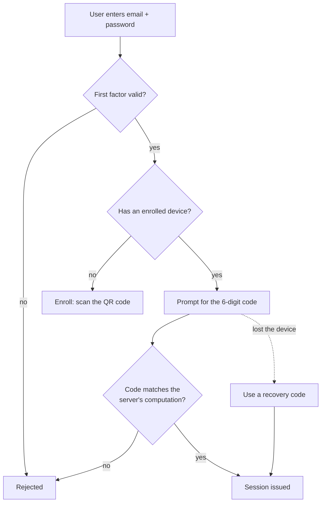

# What MFA Actually Is

> **Audience:** you have built a login form with an email and a password, and you have heard the
> term "2FA" without ever implementing it.

---

## 1. The Problem With Passwords

A password is a secret you *know*. That is its only property, and it is a weak one, because a
secret you know can be:

- **guessed** — `password123`, your dog's name, the university's founding year
- **reused** — you used it on a forum that got breached in 2019, and attackers try it everywhere
- **phished** — a convincing fake login page collects it and forwards you to the real one
- **leaked** — a company stored it badly and the database is now on a paste site
- **shoulder-surfed** — someone watched you type it in a lab

None of these require breaking any cryptography. They are all failures of the *knowledge* factor
itself. Making the password longer helps with guessing and nothing else. This is the ceiling you
hit with single-factor authentication, and no amount of "must contain a special character" fixes it.

---

## 2. The Three Factors

Authentication factors are grouped by what kind of evidence they are:

| Factor | Meaning | Examples |
|---|---|---|
| **Knowledge** | Something you **know** | Password, PIN, security question |
| **Possession** | Something you **have** | Phone with an authenticator, hardware key, smart card |
| **Inherence** | Something you **are** | Fingerprint, face, voice |

**Multi-factor authentication means using evidence from two or more different categories.**

That last part matters more than the count. A password plus a security question is not MFA — both
are knowledge, so one phishing page collects both. A password plus a code from your phone *is* MFA,
because stealing the password does not put the phone in the attacker's hand.

NLR Identity teaches **knowledge + possession**: your password, plus a device you have enrolled.

---

## 3. Why This Actually Stops Attacks

Walk through what an attacker gains at each stage.

**They have your password only.**
They reach the login form, pass the first factor, and are stopped at the code prompt. They cannot
compute the code, because the secret needed to generate it is inside your phone, encrypted. The
breach is contained.

**They have your phone but not your password.**
The app on your phone shows codes, but a code alone gets them nowhere — the first factor still
blocks them. And on a well-configured device the app itself is behind a biometric lock.

**They have both.**
Then they are in, and MFA has done all it can. This is why device loss must be reportable and
enrolled devices must be revocable. MFA raises the cost of an attack enormously; it does not make
accounts invulnerable.

The point is not perfection. It is that the two most common real-world attacks — credential stuffing
from a breach dump, and bulk phishing — both stop dead at the second factor.

---

## 4. Kinds of Second Factor, Ranked

Not all second factors are equal. Roughly, worst to best:

| Method | How it works | Weakness |
|---|---|---|
| **SMS OTP** | Server texts you a code | SIM swapping, SS7 interception, carrier social engineering. Widely deployed, genuinely weak. |
| **Email OTP** | Server emails you a code | Only as strong as your email account, which is often protected by the same password |
| **Push approval** | App shows "Approve?" | MFA fatigue — attackers spam prompts at 3am until someone taps yes |
| **TOTP** *(this project)* | Device computes a code from a shared secret + time | Phishable in real time; secret must be protected on the device |
| **Hardware key (FIDO2/WebAuthn)** | Cryptographic challenge bound to the site's origin | Phishing-resistant by design. Costs money; user must carry it. |

TOTP is the sweet spot for learning: it is genuinely used at scale, it needs no special hardware,
it works offline, and — crucially for this project — you can implement it from the RFC in about
forty lines of code and understand every one of them.

Its honest weakness is worth stating: TOTP does not stop a real-time phishing proxy. If a fake site
collects your password *and* your code and replays both within thirty seconds, it wins. WebAuthn
solves that by binding the credential to the site's origin. TOTP does not.

---

## 5. Where NLR Identity Fits

Two things in that diagram are easy to skip over and worth pausing on:

**Enrollment happens once, after the first factor passes.** You must already have proven you own
the account before you are allowed to attach a device to it — otherwise anyone could enroll their
own phone against your identity.

**Recovery codes are a real branch, not an afterthought.** Any second factor you can lose needs a
documented way back in, or you have built an account-deletion machine. Design the recovery path at
the same time as the happy path.

---

## 6. Vocabulary

You will meet these words in the code and in every article on the subject.

- **Factor** — a category of evidence (knowledge, possession, inherence)
- **2FA** — exactly two factors. **MFA** — two or more. In practice people use them interchangeably.
- **OTP** — one-time password: valid once, or for one short window
- **TOTP** — time-based OTP; the window is derived from the clock ([RFC 6238](https://datatracker.ietf.org/doc/html/rfc6238))
- **HOTP** — counter-based OTP; the window advances on use ([RFC 4226](https://datatracker.ietf.org/doc/html/rfc4226))
- **Shared secret / seed** — the random value both the device and the server hold
- **Enrollment** — the one-time act of giving a device the secret
- **Relying party** — the application asking "who are you" (here, the demo website)
- **Authenticator** — the thing that answers (here, the Flutter app)
- **Recovery code** — a single-use backup credential for when the device is gone
- **Step / time step** — the interval a TOTP code is valid for, conventionally 30 seconds

---

## 7. Next

- [totp-working.md](totp-working.md) — the actual arithmetic behind the six digits
- [authentication-flow.md](authentication-flow.md) — enrollment and login, step by step
