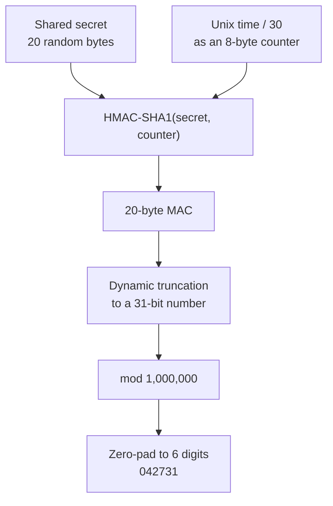

# How TOTP Works

> **Audience:** you can read a function signature and you have seen the word "hash" before.
> **Goal:** by the end you should be able to explain, without hand-waving, where the six digits
> come from and why two disconnected devices agree on them.

This page explains the algorithm. The implementation is
[`demo-website/src/services/totpService.ts`](../demo-website/src/services/totpService.ts), and
`totpService.test.ts` beside it checks that code against the published RFC vectors. Read this page
first and the code will hold no surprises.

---

## 1. The Question

Your phone is in airplane mode. It shows `042 731`. The server, three thousand kilometres away,
independently expects `042 731`. They have not communicated since the day you enrolled.

How?

The answer is that they are not *exchanging* the code. They are both *computing* it, from two
inputs they already share:

1. **A secret** — a random value handed to the device once, during enrollment
2. **The current time** — which both sides can read from their own clock

Same inputs, same function, same output. No network required. That is the whole trick, and
everything below is detail.

---

## 2. The Ingredients

### 2.1 The Shared Secret

A random string of bytes — 20 bytes (160 bits) is the common choice — generated by the server when
you enroll a device.

It is transferred using **Base32** encoding, not Base64. The reason is human: Base32 uses only
`A-Z` and `2-7`, avoiding the characters people confuse (`0`/`O`, `1`/`l`/`I`), so a secret can be
read aloud or typed manually when a camera is unavailable.

```
Base32 secret:  JBSWY3DPEHPK3PXP
Raw bytes:      48 65 6c 6c 6f 21 de ad be ef
```

This value is the crown jewel. A code expires in thirty seconds; the secret is valid until the
device is revoked. Anyone who obtains it can generate every future code.

### 2.2 The Time Counter

Wall-clock time is too precise — no two clocks agree to the millisecond. So TOTP chops time into
fixed blocks called **time steps**, conventionally 30 seconds:

```
T = floor(current_unix_time / 30)
```

Every device on Earth with a roughly correct clock computes the same `T` for the same 30-second
window. At 12:00:00 UTC, `T` is some integer; at 12:00:29 it is still that integer; at 12:00:30 it
increments. `T` is the counter, and it is why the code changes on a timer instead of on use.

Why 30 seconds? It is a usability trade-off. Shorter, and users cannot finish typing before the
code rolls. Longer, and a stolen code stays useful for too long. Thirty is the convention every
authenticator app assumes.

---

## 3. The Algorithm

TOTP ([RFC 6238](https://datatracker.ietf.org/doc/html/rfc6238)) is a thin layer over HOTP
([RFC 4226](https://datatracker.ietf.org/doc/html/rfc4226)): *HOTP, but the counter is the clock.*



### Step 1 — Build the counter

Take `T` and write it as an 8-byte big-endian integer.

```
T = 58412345  ->  00 00 00 00 03 7B 8B 79
```

### Step 2 — HMAC

Compute `HMAC-SHA1(key = secret, message = counter)`, producing 20 bytes.

HMAC is a keyed hash. Without the key you cannot produce the output, and the output leaks nothing
about the key. That property is what makes the code unforgeable: an attacker who watches a thousand
codes still cannot derive the secret.

```
HMAC-SHA1 -> 1f 86 98 69 0e 02 ca 16 61 85 50 ef 7f 19 da 8e 94 5b 55 5a
```

*(SHA-1 is broken for collision resistance — you should not sign certificates with it. HMAC-SHA1
remains safe because HMAC does not rely on collision resistance, and RFC 6238 permits SHA-256 and
SHA-512 as well. In practice almost every deployed authenticator uses SHA-1, so interoperability
usually decides this for you.)*

### Step 3 — Dynamic truncation

We need a number, not 20 bytes. But which bytes? Always taking the first four would be predictable.
So the spec derives the position *from the hash itself*:

```
offset = last_byte & 0x0F          // a value from 0 to 15
take 4 bytes starting at offset
clear the top bit                  // & 0x7FFFFFFF, avoids sign issues across languages
```

Working the example: the last byte is `0x5A`, so `offset = 0xA = 10`. Bytes 10-13 are
`50 ef 7f 19`. Masking the high bit gives `0x50ef7f19` = `1357872921`.

The high-bit mask exists purely so that languages with signed 32-bit integers and languages with
unsigned ones produce the same number. It is an interoperability fix, not a security measure.

### Step 4 — Reduce to six digits

```
1357872921 mod 1000000 = 872921  ->  "872921"
```

Zero-pad on the left if the result is shorter than six characters. `1234` must be displayed as
`001234`, and a naive integer-to-string conversion is a classic bug here.

---

## 4. Reference Pseudocode

Not runnable code — a description you could translate into any language.

```text
function totp(secret_base32, time = now(), step = 30, digits = 6):
    key      = base32_decode(secret_base32)
    counter  = floor(time / step)
    message  = counter as 8-byte big-endian
    mac      = hmac_sha1(key, message)              // 20 bytes

    offset   = mac[19] & 0x0F
    binary   = ((mac[offset]     & 0x7F) << 24)
             | ((mac[offset + 1] & 0xFF) << 16)
             | ((mac[offset + 2] & 0xFF) << 8)
             |  (mac[offset + 3] & 0xFF)

    return zero_pad(binary mod 10^digits, digits)
```

Around forty lines in a real language, most of it Base32 decoding. That is the entire mechanism
behind every authenticator app you have used.

---

## 5. Clock Drift and the Verification Window

Clocks disagree. A phone that has been offline for a week may be several seconds off, and a user
who starts typing at second 29 will submit during the next step.

Servers therefore check more than one counter:

```
accept if submitted_code matches totp(secret, T-1)
                              or totp(secret, T)
                              or totp(secret, T+1)
```

That is a plus-or-minus one step window: roughly 90 seconds of tolerance. Widening it is tempting
and wrong — every extra step multiplies an attacker's brute-force surface and extends how long a
stolen code stays usable. If users routinely fail, the fix is to tell them to enable automatic time
sync, not to accept five steps either side.

**Replay protection.** A code that verifies successfully must be marked as used for that
`(device, counter)` pair. Without it, a code shouted across a room or captured by a proxy works
again for the rest of its window.

---

## 6. Provisioning: The QR Code

Enrollment transfers the secret using the `otpauth://` URI scheme, rendered as a QR code because
nobody wants to type twenty random bytes.

```
otpauth://totp/NLR%20Identity:student@example.com
    ?secret=JBSWY3DPEHPK3PXP
    &issuer=NLR%20Identity
    &algorithm=SHA1
    &digits=6
    &period=30
```

| Parameter | Meaning |
|---|---|
| Label (path) | `Issuer:account` — what the app shows in its list |
| `secret` | The Base32 shared secret |
| `issuer` | Service name; keep it consistent with the label prefix |
| `algorithm` | `SHA1`, `SHA256`, or `SHA512` |
| `digits` | `6` or `8` |
| `period` | Time step in seconds |

Yes — the secret is in the QR code in plaintext. There is no alternative; the device has to learn it
somehow. What makes it acceptable is that it is delivered over TLS, displayed exactly once, expires
in minutes, and is never re-rendered. Anyone photographing your screen during those minutes has
your second factor, which is precisely why enrollment tells you not to share it.

---

## 7. Common Implementation Mistakes

Every one of these has shipped in real code.

| Mistake | Result |
|---|---|
| Using local time instead of UTC | Works on your machine, fails for every user in another zone |
| Forgetting to zero-pad | `001234` is rendered as `1234`; every tenth code fails |
| Base64 instead of Base32 | Decodes to the wrong bytes; nothing ever matches |
| Skipping the `0x7F` mask | Negative numbers in Java or Dart; codes differ by platform |
| Accepting a ten-step window | 20x the brute-force surface, to fix a clock problem |
| `==` for string comparison of codes | Timing side channel; use a constant-time compare |
| Storing generated codes | A code in the database is a code an attacker can read |
| Not marking a code as used | Replay works for the remainder of the window |
| Rate limit missing | Six digits is a million options; unlimited guesses breaks it in hours |

---

## 8. Read the Sources

- [RFC 6238 — TOTP](https://datatracker.ietf.org/doc/html/rfc6238)
- [RFC 4226 — HOTP](https://datatracker.ietf.org/doc/html/rfc4226)
- [RFC 2104 — HMAC](https://datatracker.ietf.org/doc/html/rfc2104)
- [RFC 4648 — Base32/Base64](https://datatracker.ietf.org/doc/html/rfc4648)
- [Key Uri Format](https://github.com/google/google-authenticator/wiki/Key-Uri-Format) — the
  de-facto specification for `otpauth://`

The RFCs are short and contain test vectors. Implementing TOTP against the RFC 6238 vectors is one
of the most satisfying afternoons available to a developer learning cryptography.

---

## 9. Next

- [authentication-flow.md](authentication-flow.md) — where this sits in enrollment and login
- [database-design.md](database-design.md) — how the secret is stored, and what is not stored
